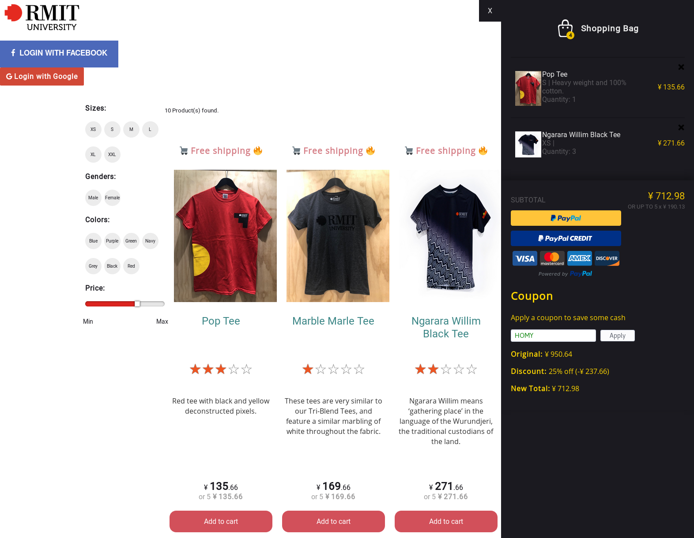

## 🛍️ RMIT University E-Commerce Shopping Cart
<p align="center">
  
  
  
  
  <br/>
  
</p>

## About

Software Engineering: Processes & Tools Major Assignment, special thanks to Jefferson Ribeiro for the
<a href="https://github.com/jeffersonRibeiro/react-shopping-cart">original project</a>.

#### Requirements

- Node.js
- NPM

### Installation

In the projects root directory execute
``` bash
npm install
```

### Running

Run the products API server
``` bash
npm run server
```

Run the react app
``` bash
npm run client
```

The website will be availible on `http://localhost:3000`
The products API server will be running on `http://localhost:8001/api/products`

### Testing

Unit tests were done using Mocha, to run them simply execute
``` bash
npm run test
```

#### Authors
- Michael Dao
- Blaise Saunders
- William Cohen
- Mitchell Maligeorges

### Tech Stack
- React
  * Redux - for application state management
  * Paypal Component
  * Google Login Componenet
  * Facebook Login Component
- Nodejs
  * Express CORS Middleware
  * Nodemon - for watching for server changes
  * Mocha - Unit Testing
- Axios - for promise HTTP requests
- Native local storage API - for product persistence in floating cart
- CSS
  * BEM methodology

### Copyright and license

The MIT License (MIT).
Please see License File for more information.
